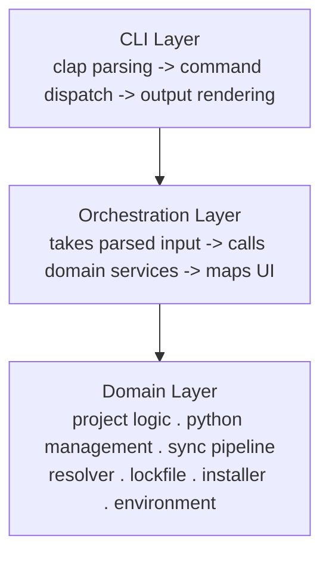
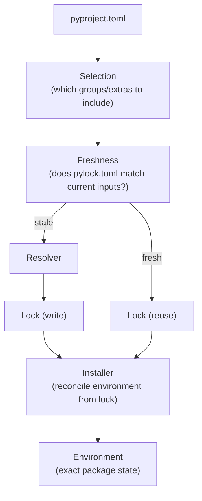

Pyra maintains strict separation between its major subsystems. This page documents the boundaries, data flow, and the reasoning behind the current architecture.

## System boundaries

### CLI layer

Responsible for:
- clap struct/enum definitions
- Argument parsing
- Command routing

Does not contain business logic, filesystem operations, or formatted output.

### Orchestration layer

Responsible for:
- Taking parsed CLI input
- Calling domain services
- Mapping results into presentation output

Does not contain deep business rules or terminal style definitions.

### Domain layer

Responsible for:
- Project logic, Python management, environment management
- Resolution, locking, installation
- Validation and state changes

Returns typed results and typed errors. Does not print directly or depend on CLI types.

### Presentation layer

Responsible for:
- Terminal output, styles, and formatting
- Error rendering
- JSON envelope serialization

The only place where user-facing terminal formatting happens.

## The resolver / lock / installer split

The dependency pipeline is split across three independent responsibilities:

### Resolver

**Owns:**
- Reading index metadata (PyPI Simple API)
- Interpreting dependency specifiers and markers
- Choosing compatible package versions
- Producing typed resolved package results

**Does not own:**
- Reading `pyproject.toml` directly
- Terminal output
- Installing packages
- Deciding lock freshness

### Lock

**Owns:**
- Persisting resolved state to `pylock.toml`
- Recording environments, groups, extras, and artifacts
- Recording freshness metadata
- Serving as the installation source of truth

**Does not own:**
- Re-resolving during installation
- Acting as the package installer

### Installer

**Owns:**
- Inspecting current environment state
- Comparing installed state against selected lock subset
- Planning install and removal actions
- Downloading, verifying, and caching artifacts
- Applying actions to the environment
- Installing the current project editable

**Does not own:**
- Resolving dependency versions
- Deciding what the desired package graph should be

## Data flow

## The pip boundary

Pyra currently uses pip behind a strict boundary:

- `python -m pip install --no-deps` — apply locked artifacts
- `python -m pip uninstall` — remove packages

Key constraints:

- pip is only used to apply explicit locked artifacts
- pip is never allowed to resolve dependencies
- The desired package set always comes from `pylock.toml`

This boundary keeps the system honest: pip is an implementation detail of the installer, not part of the resolution or locking model. It can be replaced with a native installer without changing the sync pipeline.

## Why the boundaries matter

Without strict boundaries:

- Resolution logic would leak into installation
- Installation could silently resolve, creating "phantom" dependencies
- Lock freshness would become ambiguous
- Testing each subsystem independently would be difficult

The boundaries ensure that each subsystem can be reasoned about, tested, and eventually replaced independently.
